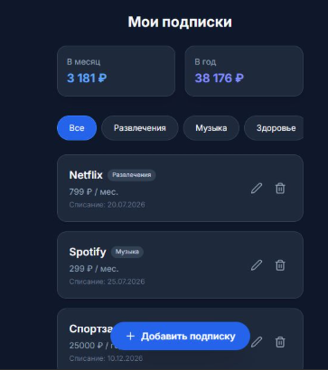

# SubTracker — трекер подписок

Веб-приложение для учёта личных платных подписок. Помогает видеть, сколько денег уходит на подписки в месяц и в год, не забывать про списания и не платить за сервисы, которыми уже не пользуешься.

> Проект собран на платформе Kodik в рамках хакатона Kodik Launchpad.

## Что умеет

- Добавление, редактирование и удаление подписок
- Автоматический подсчёт трат в месяц и в год (с пересчётом месячных и годовых периодов)
- Категории подписок и фильтрация по ним
- Подсветка подписок, у которых списание уже скоро (≤ 3 дней)
- Отметка истёкших подписок и быстрое продление на следующий период
- Сохранение данных между запусками (SQLite)
- Адаптивный тёмный интерфейс под мобильные устройства

## Технологии

- **Backend:** Python 3 (стандартная библиотека `http.server`, без внешних зависимостей)
- **База данных:** SQLite
- **Frontend:** HTML, JavaScript (без фреймворков)
- **Стили:** Tailwind CSS (через CDN)
- **Иконки:** Lucide

Приложению не нужны сторонние пакеты — достаточно установленного Python.

## Структура проекта

PythonProject/
├── app.py            # точка входа: запуск HTTP-сервера
├── handler.py        # обработка HTTP-запросов (маршруты API)
├── database.py       # работа с базой данных (SQLite)
├── validators.py     # валидация входных данных
├── templates/
│   └── index.html    # разметка страницы
└── static/
    └── app.js        # клиентская логика (JavaScript)


Логика намеренно разделена по модулям: сервер, обработчик запросов, доступ к данным и валидация лежат в отдельных файлах.


## Как запустить

Понадобится установленный Python 3.

1. Скачать или клонировать проект.
2. Открыть терминал в папке проекта.
3. Запустить сервер:

python app.py

4. Открыть в браузере:

http://localhost:5000

База данных `subscriptions.db` создаётся автоматически при первом запуске и наполняется примерами подписок.


## API

Приложение предоставляет простой REST API:

| Метод  | Путь                     | Действие                        |
|--------|--------------------------|---------------------------------|
| GET    | `/api/subscriptions`     | Получить все подписки           |
| POST   | `/api/subscriptions`     | Добавить подписку               |
| PUT    | `/api/subscriptions/{id}`| Обновить подписку по id         |
| DELETE | `/api/subscriptions/{id}`| Удалить подписку по id          |

Все входные данные проверяются на сервере: обязательное название, числовая неотрицательная стоимость, корректный период и формат даты.

## Пользовательский сценарий

1. Пользователь открывает приложение и видит список своих подписок и суммарные траты.
2. Нажимает «Добавить подписку», указывает название, стоимость, период, категорию и дату списания.
3. Суммы «в месяц» и «в год» автоматически пересчитываются.
4. Приложение подсвечивает подписки, у которых списание уже скоро, чтобы вовремя отменить ненужные.


## Demo

- 🔗 Приложение на маркетплейсе Kodik: `<ВСТАВЬ ССЫЛКУ>`
- 🎥 Видео-демо / статья: `<ВСТАВЬ ССЫЛКУ>`


## Скриншоты

<!-- Вставь сюда 1-2 скриншота приложения.
     В GitHub/маркетплейсе это делается так:
     
--># SubTracker — трекер подписок

Веб-приложение для учёта личных платных подписок. Помогает видеть, сколько денег уходит на подписки в месяц и в год, не забывать про списания и не платить за сервисы, которыми уже не пользуешься.

> Проект собран на платформе Kodik в рамках хакатона Kodik Launchpad.

---

## Что умеет

- Добавление, редактирование и удаление подписок
- Автоматический подсчёт трат в месяц и в год (с пересчётом месячных и годовых периодов)
- Категории подписок и фильтрация по ним
- Подсветка подписок, у которых списание уже скоро (≤ 3 дней)
- Отметка истёкших подписок и быстрое продление на следующий период
- Сохранение данных между запусками (SQLite)
- Адаптивный тёмный интерфейс под мобильные устройства

---

## Технологии

- **Backend:** Python 3 (стандартная библиотека `http.server`, без внешних зависимостей)
- **База данных:** SQLite
- **Frontend:** HTML, JavaScript (без фреймворков)
- **Стили:** Tailwind CSS (через CDN)
- **Иконки:** Lucide

Приложению не нужны сторонние пакеты — достаточно установленного Python.

---

## Структура проекта

```
PythonProject/
├── app.py            # точка входа: запуск HTTP-сервера
├── handler.py        # обработка HTTP-запросов (маршруты API)
├── database.py       # работа с базой данных (SQLite)
├── validators.py     # валидация входных данных
├── templates/
│   └── index.html    # разметка страницы
└── static/
    └── app.js        # клиентская логика (JavaScript)
```

Логика намеренно разделена по модулям: сервер, обработчик запросов, доступ к данным и валидация лежат в отдельных файлах.

---

## Как запустить

Понадобится установленный Python 3.

1. Скачать или клонировать проект.
2. Открыть терминал в папке проекта.
3. Запустить сервер:

```
python app.py
```

4. Открыть в браузере:

```
http://localhost:5000
```

База данных `subscriptions.db` создаётся автоматически при первом запуске и наполняется примерами подписок.

---

## API

Приложение предоставляет простой REST API:

| Метод  | Путь                     | Действие                        |
|--------|--------------------------|---------------------------------|
| GET    | `/api/subscriptions`     | Получить все подписки           |
| POST   | `/api/subscriptions`     | Добавить подписку               |
| PUT    | `/api/subscriptions/{id}`| Обновить подписку по id         |
| DELETE | `/api/subscriptions/{id}`| Удалить подписку по id          |

Все входные данные проверяются на сервере: обязательное название, числовая неотрицательная стоимость, корректный период и формат даты.

---

## Пользовательский сценарий

1. Пользователь открывает приложение и видит список своих подписок и суммарные траты.
2. Нажимает «Добавить подписку», указывает название, стоимость, период, категорию и дату списания.
3. Суммы «в месяц» и «в год» автоматически пересчитываются.
4. Приложение подсвечивает подписки, у которых списание уже скоро, чтобы вовремя отменить ненужные.

---

## Demo

- 🔗 Приложение на маркетплейсе Kodik: `<ВСТАВЬ ССЫЛКУ>`
- 🎥 Видео-демо / статья: `<ВСТАВЬ ССЫЛКУ>`

---

## Скриншоты

<!-- Вставь сюда 1-2 скриншота приложения.
     В GitHub/маркетплейсе это делается так:
     
-->


`<ВСТАВЬ СКРИНШОТ ГЛАВНОГО ЭКРАНА>`